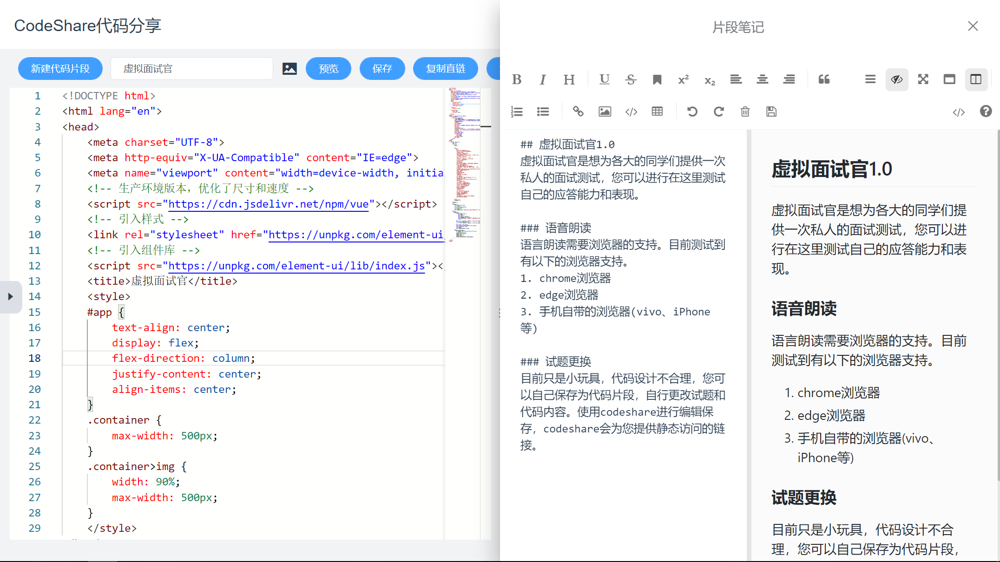

# 在线编辑器
在线编辑器是CodeShare进行代码在线编辑和预览的页面，在这里你可以对代码片段进行修改和预览并且还提供目录管理器和片段笔记等功能，极大的提升了代码片段的使用体验和效率。

## 预览
当您修改了代码点击预览按钮就会在旁边的预览窗口重新渲染。

## 保存
当您登录账号后您可以保存代码片段的修改。

## 复制直链
代码片段可以通过直链直接访问，直接可以把codeshare当作静态网页服务器来使用。

## 复制链接
复制当前编辑页面的链接以分享给其他同学。

## 文件管理器
点击左边小三角形弹出文件管理器，当您打开的是项目型代码片段将会显示对应的目录，选择对应的文件即可显示对应文件的代码或预览。

## 片段笔记
我们深知仅有代码片段是不够能够学习的，因此提供了片段笔记的功能，您可以对该片段做一些笔记供后人阅读也可以阅读别人撰写的笔记。

